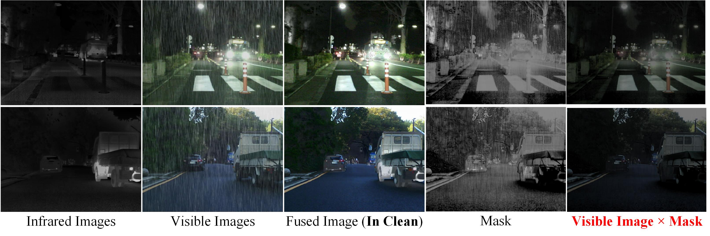
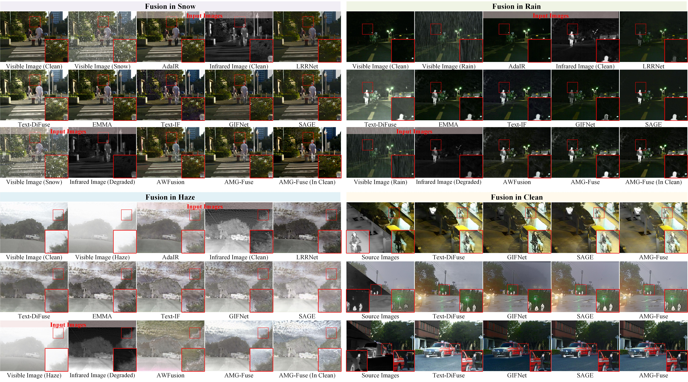

# Multi-modality Image Fusion under Adverse Weather: Mask-Guided Feature Restoration and Interaction (ECCV 2026)

[](https://eccv2026.ecva.net/)
[](https://www.python.org/)
[](https://pytorch.org/)
[](LICENSE)

**Xilai Li<sup>1</sup>, Xiaosong Li<sup>1,†</sup>, Haishu Tan<sup>1</sup>, Tao Ye<sup>2</sup>, Huafeng Li<sup>3</sup>, Hongbin Wang<sup>3</sup>**

<sup>1</sup>Foshan University, Foshan, China  
<sup>2</sup>China University of Mining and Technology, Beijing, China  
<sup>3</sup>Kunming University of Science and Technology, Kunming, China  
<sup>†</sup>Corresponding author

[[Paper](https://arxiv.org/pdf/2606.26812)] | [[Dataset](https://ixilai.github.io/AWMM-100K/)]

---

## 🔥 Highlights

- **Mask-Guided Learning Strategy (MGLS)**: Dynamic modality allocation through learned masks for optimal feature fusion
- **Task-Coupled Degradation-Aware Strategy (TDAS)**: Joint optimization of fusion and restoration tasks
- **Pseudo Ground Truth from EMMA**: Training stabilization using pre-trained EMMA model
- **State-of-the-art Performance**: Superior results on AWMM-100k dataset across snow, rain, and haze conditions

---

## 🏗️ Framework

<p align="center">
  
</p>

**AMG-Fuse** fuses visible (VI) and infrared (IR) images under adverse weather conditions through:

1. **Encoder-Decoder Architecture**: Multi-scale U-Net with skip connections
2. **Dynamic Histogram Self-Attention**: Value-range aware attention mechanism
3. **Channel Fusion Attention**: Cross-modal attention with SE-based adaptive weighting
4. **Mask-Guided Fusion**: 8-level hierarchical fusion with learnable masks

---

## 🚀 Installation

### Prerequisites

- Python >= 3.8
- PyTorch >= 1.13.0
- CUDA >= 11.6 (for GPU acceleration)

### Setup Environment

```bash
# Clone the repository
git clone https://github.com/your-username/AMG-Fuse.git
cd AMG-Fuse

# Create conda environment
conda create -n amgfuse python=3.8
conda activate amgfuse

# Install PyTorch (example for CUDA 11.8)
pip install torch==2.0.0 torchvision==0.15.0 --index-url https://download.pytorch.org/whl/cu118

# Install dependencies
pip install -r requirements.txt
```

---

## 📦 Dataset Preparation

### AWMM-100k Dataset

Download the dataset from: [https://ixilai.github.io/AWMM-100K/](https://ixilai.github.io/AWMM-100K/)

The AWMM-100k dataset contains 3,000 training images (1,000 each for snow, rain, haze) and 150 test images.

**Expected directory structure:**

```
data/
├── train/
│   ├── Snow/
│   │   ├── vi/           # Degraded visible images
│   │   ├── ir/           # Degraded infrared images
│   │   ├── gt_vi/        # Clean visible images
│   │   ├── gt_ir/        # Clean infrared images
│   │   └── pseudo_gt/    # Pseudo ground truth from EMMA
│   ├── Rain/
│   │   └── ...
│   └── Haze/
│       └── ...
└── test/
    ├── Snow/
    │   ├── vi/
    │   └── ir/
    ├── Rain/
    └── Haze/
```

### Generate Pseudo Ground Truth with EMMA

Use the pretrained EMMA model to generate pseudo ground truth for training:

```bash
# Assuming you have EMMA installed and pretrained weights
# Run EMMA on clean image pairs to generate pseudo GT
# Place the output in data/train/{Weather}/pseudo_gt/
```

---

## 🏋️ Training

### Restormer Checkpoint for TDAS

The training process uses pre-trained Restormer weights for the **Task-Coupled Degradation-Aware Strategy (TDAS)**. You need to prepare weather-specific Restormer checkpoints:

- **Derain checkpoint**: For training on rain scenarios
- **Desnow checkpoint**: For training on snow scenarios  
- **Dehaze checkpoint**: For training on haze scenarios

Download or prepare your Restormer checkpoints and place them in `checkpoints/restormer/` directory.

### Distributed Training (Recommended)

Train on multiple GPUs using PyTorch DDP with Restormer checkpoint:

```bash
torchrun --nproc_per_node=4 train.py \
    --ir_path data/train/Snow/ir \
    --vi_path data/train/Snow/vi \
    --gt_path data/train/Snow/gt_vi \
    --gt_ir_path data/train/Snow/gt_ir \
    --method_path data/train/Snow/pseudo_gt \
    --restormer_ckpt checkpoints/restormer/desnow.pth \
    --batch_size 6 \
    --patch_size 168 \
    --lr 1e-4 \
    --n_epochs 200 \
    --warmup_epochs 5 \
    --save_dir checkpoints/snow
```

**Important**: Use `--restormer_ckpt` argument to specify the path to weather-specific Restormer checkpoint. If not provided, training will run without TDAS (`use_restormer=False`).

### Single GPU Training

```bash
python train.py \
    --ir_path data/train/Snow/ir \
    --vi_path data/train/Snow/vi \
    --gt_path data/train/Snow/gt_vi \
    --gt_ir_path data/train/Snow/gt_ir \
    --method_path data/train/Snow/pseudo_gt \
    --restormer_ckpt checkpoints/restormer/desnow.pth \
    --batch_size 2 \
    --n_epochs 200 \
    --save_dir checkpoints/snow
```

### Key Training Parameters

| Parameter | Description | Default |
|-----------|-------------|---------|
| `--batch_size` | Batch size per GPU | 2 |
| `--patch_size` | Training patch size | 168 |
| `--lr` | Initial learning rate | 1e-4 |
| `--n_epochs` | Total training epochs | 200 |
| `--warmup_epochs` | Warmup epochs | 5 |
| `--clip_grad` | Gradient clipping | 1e-4 |

---

## 🧪 Testing

### Inference on Image Pairs

```bash
python test.py \
    --ir_path data/test/Snow/ir \
    --vi_path data/test/Snow/vi \
    --save_path results/snow \
    --ckpt checkpoints/snow/epoch_200.pth
```

The model automatically handles arbitrary image sizes with padding.

---

## 📊 Visual Results

### Visualization of Mask-Guided Degradation Suppression

<p align="center">
  
</p>

**Figure 5**: Visualization of Mask-Guided Degradation Suppression in Visible Feature Reweighting. The figure demonstrates how the learned mask effectively captures the distribution of degraded areas in rain scenes. Most rain streaks have been successfully suppressed or removed based on observation results, validating the effectiveness of the Task-Coupled Degradation-Aware Learning Strategy (TDAS) in guiding the fusion network to prioritize processing clearer and more prominent regions.

### Qualitative Comparison under Adverse Weather

<p align="center">
  
</p>

**Figure 6**: Qualitative comparison results of all methods in four adverse weather scenarios (Snow, Rain, Haze, and Clean). 

- **Snow Weather**: While AdaIR effectively removes snow, it causes significant detail loss, resulting in blurred output for LRRNet, Text-IF, and SAGE. In contrast, AMG-Fuse effectively eliminates degradation artifacts, preserves key details, and fully exploits the complementary information between modalities.

- **Rain Weather**: AdaIR removes rain streaks but oversmoothes textures, leading to diminished scene details. LRRNet and GIFNet fail to sufficiently highlight infrared cues, while EMMA, Text-IF, and SAGE enhance occluded visible targets but fail to capture fine infrared textures. AMG-Fuse maintains a strong balance between multi-modal interaction and subtle visible details.

- **Haze Weather**: Haze introduces depth-dependent degradation, complicating feature extraction. LRRNet, Text-DiFuse, and SAGE exhibit significant contrast loss, while EMMA and Text-IF produce outputs that diverge from perceptual expectations. AWFusion introduces color distortions. AMG-Fuse effectively suppresses haze artifacts, generating visually natural and structurally rich fused images.

---

## 📥 Pretrained Models

### AMG-Fuse Fusion Checkpoints

Download pretrained fusion models for different weather conditions:

| Weather | Download Link | File Size |
|---------|---------------|-----------|
| Snow | [Google Drive](https://drive.google.com/file/d/1jnYyVE-EYIuy1KkgOSOIuAR9voAEvaAy/view?usp=sharing) | ~370 MB |
| Rain | [Google Drive](https://drive.google.com/file/d/1olSESm-7bmSQukuzCYT9UO7MUDzsrqpx/view?usp=sharing) | ~370 MB |
| Haze | [Google Drive](https://drive.google.com/file/d/1IB705rNTScfX6XQ6bdavZY0voE204D2a/view?usp=sharing) | ~370 MB |

**Note**: The checkpoint files are large (~370MB each) because they include the weights of the Restormer restoration network used for supervising the training process (TDAS component).

Place downloaded models in `checkpoints/` directory.

### Restormer Checkpoints (Required for Training)

For training with TDAS, you need pre-trained Restormer weights for the specific weather condition:
- **Derain**: Restormer pre-trained on rain removal
- **Desnow**: Restormer pre-trained on snow removal
- **Dehaze**: Restormer pre-trained on dehazing

These weights are used to guide the fusion network during training. The released AMG-Fuse checkpoints already include these weights, so they are **only needed if you want to retrain the model from scratch**.

---

## 📖 Citation

If you find this work useful, please cite:

```bibtex
@misc{li2026multimodalityimagefusionadverse,
      title={Multi-modality Image Fusion under Adverse Weather: Mask-Guided Feature Restoration and Interaction}, 
      author={Xilai Li and Xiaosong Li and Haishu Tan and Tao Ye and Huafeng Li and Hongbin Wang},
      year={2026},
      eprint={2606.26812},
      archivePrefix={arXiv},
      primaryClass={cs.CV},
      url={https://arxiv.org/abs/2606.26812}, 
}
```

---

## 🙏 Acknowledgements

This work builds upon several excellent open-source projects:

- [Restormer](https://github.com/swz30/Restormer) - Transformer architecture design
- [EMMA](https://github.com/Zhaozixiang1228/MMIF-EMMA) - Pseudo ground truth generation
- [AWMM-100k](https://ixilai.github.io/AWMM-100K/) - Dataset

We thank the authors for making their code publicly available.

---

## 📧 Contact

For questions and feedback, please contact:

- Xilai Li: 20210300236@stu.fosu.edu.cn
- Xiaosong Li (Corresponding): lixiaosong@buaa.edu.cn
- GitHub Issues: [https://github.com/ixilai/AMG-Fuse/issues](https://github.com/your-username/AMG-Fuse/issues)

---

## 📄 License

This project is licensed under the MIT License - see the [LICENSE](LICENSE) file for details.
